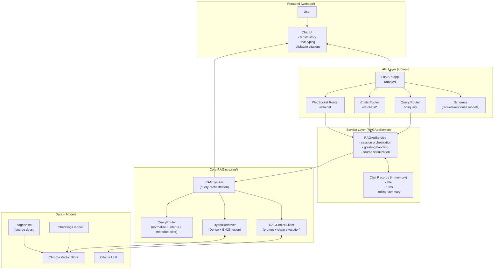

# Fine Arts Chat Web App

Lightweight frontend for the RAG API with:
- WebSocket live chat (`/ws/chat`)
- HTTP fallback query (`/v1/query`)
- Fine-arts styled interface (responsive desktop/mobile)

## Chatbot Architecture (Composed Components)



## Run

1. Start API:
```bash
python main.py --api --host 127.0.0.1 --port 8000
```

2. Serve this folder:
```bash
python -m http.server 5500 -d webapp
```

3. Open:
```text
http://127.0.0.1:5500
```

The UI auto-connects to `http://<current-host>:8000` and uses backend chat tabs/history.
